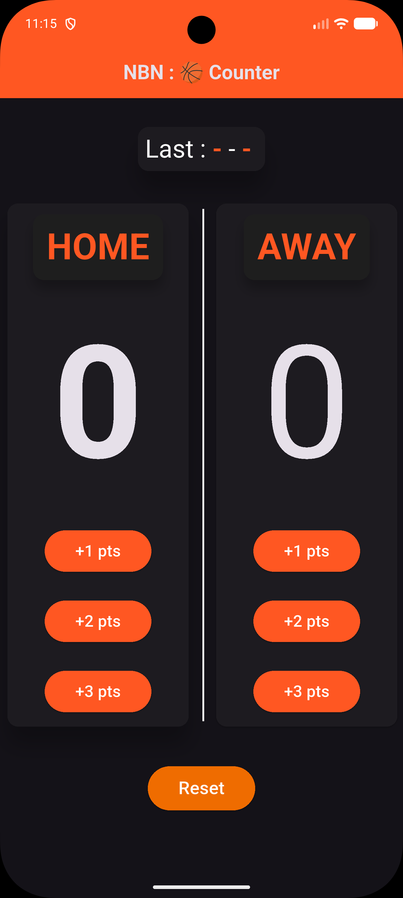
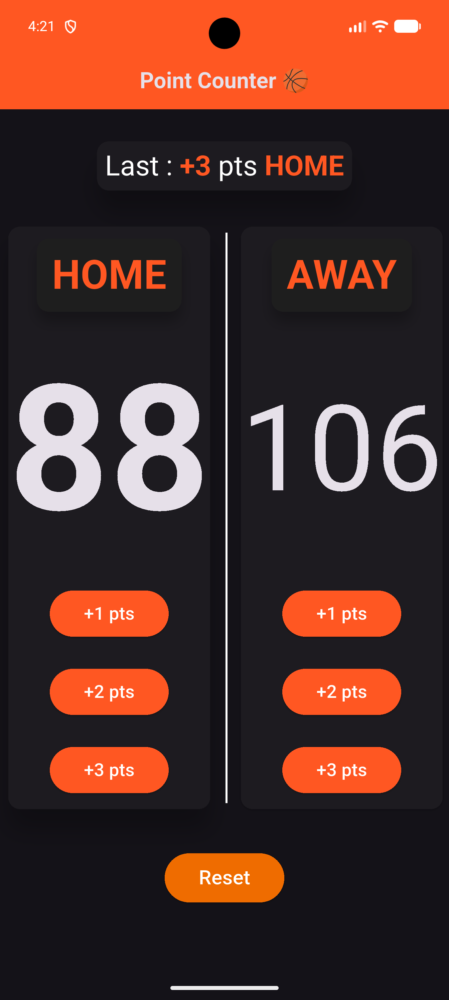
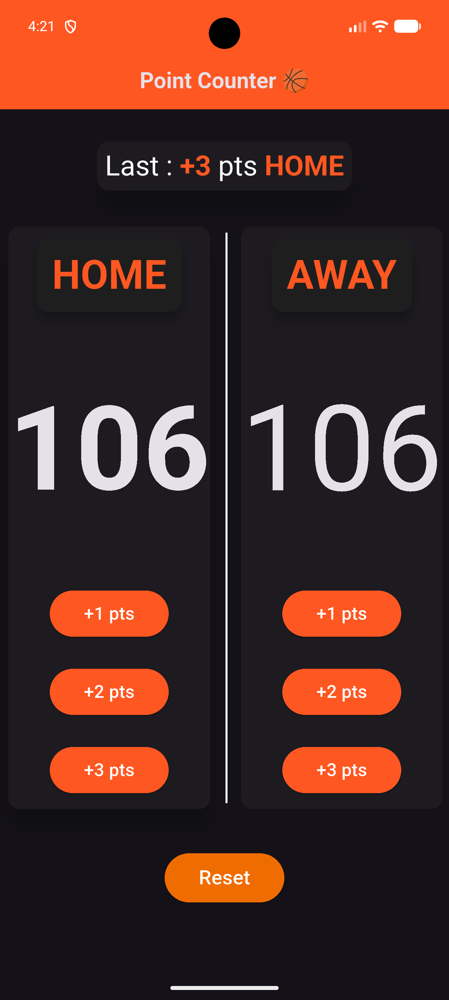
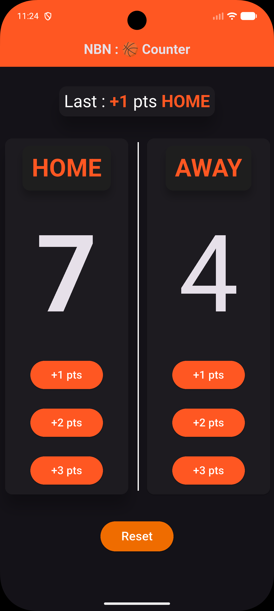
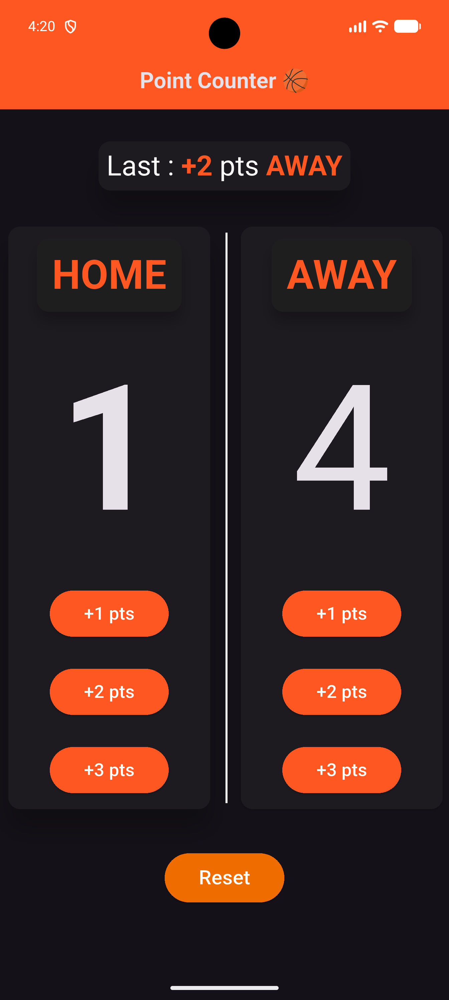
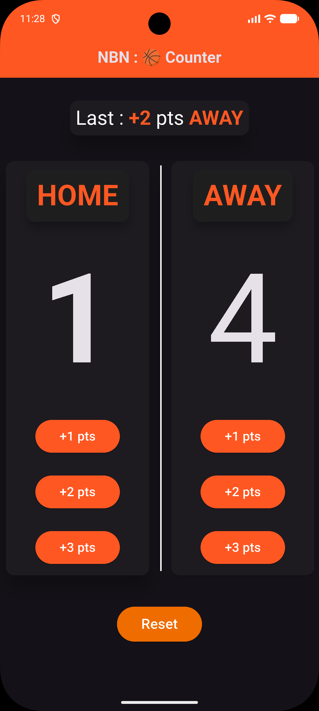

<div align="center">

# 🏀 NBN Basketball

[](https://flutter.dev)
[](https://dart.dev)
[](LICENSE)
[](https://flutter.dev)

**"Nothing But Net" – A sleek, professional basketball point counter built with Flutter.**

[✨ Features](#-features) • [📸 Screenshots](#-screenshots) • [🏗️ Architecture](#-architecture) • [🚀 Getting Started](#-getting-started) • [👤 Author](#-author)

</div>

---

## 🎯 Overview

**NBN Basketball** is a clean and intuitive basketball score counter app built with Flutter. Designed for coaches, players, and fans who need a fast, reliable way to track points during pickup games, practice sessions, or friendly matches. Features a professional dark theme, real-time score updates, and last-point tracking.

### 💡 Key Highlights
- 🏀 **Dual Team Tracking** – Home vs Away with independent score counters
- ⚡ **Instant Scoring** – +1, +2, +3 point buttons for quick updates
- 🎯 **Last Point Display** – Shows the most recent score and which team made it
- 🔄 **One-Tap Reset** – Reset the entire game with a single button
- 🌙 **Dark Theme** – Professional dark UI optimized for indoor courts
- 📱 **Responsive Layout** – Works on phones and tablets

---

## ✨ Features

### 🏀 Core Features
- **Dual Team Counter** – Track scores for Home and Away teams simultaneously
- **Quick Score Buttons** – +1, +2, +3 point buttons per team
- **Last Action Display** – Shows last points scored and by which team
- **Game Reset** – Reset all scores instantly
- **Dark Mode UI** – Easy on the eyes during games

### ⚙️ Technical Features
- **setState Management** – Simple, reactive state updates
- **Responsive Cards** – `IntrinsicHeight` and `FittedBox` for adaptive layouts
- **Custom Widgets** – Reusable `CustomButton` and `TeamTitle` components
- **Dark Theme** – `Brightness.dark` with `deepOrange` accents

---

## 📸 Screenshots

<div align="center">

| 🏀 Start View | 📊 Two Teams View |
|:-------------:|:-----------------:|
|  |  |
| Initial scoreboard (0-0) | Both teams with scoring buttons |

| 🏠 Home Team Score | 🏠 Home Team Score +3 |
|:------------------:|:---------------------:|
|  |  |
| Home team scoring | Home team with +3 points |

| ✈️ Away Team Score | ✈️ Away Team Score +2 |
|:------------------:|:---------------------:|
|  |  |
| Away team scoring | Away team with +2 points |

</div>

---

## 🛠️ Technical Stack

<div align="center">

| Component         | Technology      | Purpose                  |
|:-----------------:|:----------------:|:------------------------:|
| **Framework**     | Flutter 3.x      | Cross-platform UI        |
| **Language**      | Dart 3.x         | Core development         |
| **State Mgmt**    | setState         | Simple reactive state    |
| **Design**        | Material 3       | Dark theme + components  |

</div>

---

## 🏗️ Architecture

### 📁 Project Structure

```
lib/
├── main.dart                    # App entry point (NBNBasketball widget)
│
├── Views/
│   └── Main_View.dart           # Main score counter screen
│
├── Widgets/
│   ├── Custom_Button.dart       # Reusable +1/+2/+3 point button
│   └── Team_Title.dart          # Team name header widget
│
└── helper/
    └── constants.dart           # Team name constants (HOME, AWAY)
```

### 🔄 Data Flow

```
┌─────────────┐
│  User Tap   │
│ (+1/+2/+3)  │
└──────┬──────┘
       │
       ▼
┌─────────────┐     ┌─────────────┐
│  setState   │────▶│  UI Update  │
│ updateScore │     │ (Score +    │
│             │     │  Last Point)│
└─────────────┘     └─────────────┘
```

---

## 🧩 Core Logic

### Score Update
```dart
void updateScore(int pts, String team) {
  setState(() {
    if (team == kTeamOne) {
      homePoints += pts;
      teamName = kTeamOne;
    } else {
      awayPoints += pts;
      teamName = kTeamTwo;
    }
    lastPoint = pts;
  });
}
```

### Constants
```dart
const String kTeamOne = "HOME";
const String kTeamTwo = "AWAY";
```

---

## 🎨 UI Design

### Color Scheme
- **Primary:** `Colors.deepOrange` — AppBar, buttons, accents
- **Background:** Dark theme (`Brightness.dark`)
- **Cards:** Elevated with shadow for depth
- **Text:** White with orange highlights

### Layout
- **Top:** Last action display card
- **Middle:** Two team columns with scores and buttons
- **Bottom:** Reset button

---

## 📦 Dependencies

```yaml
dependencies:
  flutter:
    sdk: flutter
```

```bash
flutter pub get
```

---

## 🚀 Getting Started

### 📋 Prerequisites

| Requirement   | Version   | Purpose           |
|:-------------:|:---------:|:-----------------:|
| Flutter SDK   | >=3.0.0   | Framework         |
| Dart SDK      | >=3.0.0   | Language          |

### 💻 Installation

```bash
# 1. Clone the repository
git clone https://github.com/ahmed-el-bialy/nbn_basketball.git
cd nbn_basketball

# 2. Install dependencies
flutter pub get

# 3. Run the app
flutter run

# Build for production
flutter build apk --release      # Android
flutter build ios --release      # iOS
```

---

## ⚠️ Known Limitations

| Issue              | Details                        | Status       |
|:-------------------|:-------------------------------|:------------:|
| No game timer      | No shot clock or game clock    | 🔧 Planned   |
| No score history   | Cannot view previous games     | 🔧 Planned   |
| No team names      | Fixed "HOME" and "AWAY" labels | 🔧 Planned   |
| No export/share    | Cannot save or share scores    | 🔧 Planned   |
| No fouls tracking  | No personal/team foul counter  | 🔧 Planned   |

---

## 🔮 Roadmap

- [ ] **Game Timer** — Shot clock and game clock
- [ ] **Custom Team Names** — Edit team names before game
- [ ] **Score History** — Save and view past games
- [ ] **Fouls Tracking** — Personal and team fouls
- [ ] **Export/Share** — Share final score via screenshot or text
- [ ] **Quarters Support** — Track scores per quarter
- [ ] **Sound Effects** — Buzzer and scoring sounds
- [ ] **Player Stats** — Track individual player points

---

## 🤝 Contributing

Contributions are welcome!

1. **Fork** the repository
2. **Create** a feature branch: `git checkout -b feature/your-feature`
3. **Commit** your changes: `git commit -m 'feat: Add awesome feature'`
4. **Push** to the branch: `git push origin feature/your-feature`
5. **Open** a Pull Request

---

## 📄 License

This project is licensed under the **MIT License** — see the [LICENSE](LICENSE) file for details.

---

## 👤 Author

**Ahmed El-Bialy**  
*Flutter Developer | Mobile App Specialist*

<div align="center">

[](https://www.linkedin.com/in/ahmedel-bialy/)
[](mailto:ah.elbialy.dev@gmail.com)
[](tel:+201022121573)
[](https://github.com/ahmed-el-bialy)

</div>

📧 **Email:** ah.elbialy.dev@gmail.com  
📞 **Phone:** +20 102 212 1573

---

<div align="center">

### ⭐ Star this repo if you found it helpful!

**Built with ❤️ by Ahmed El-Bialy**

</div>